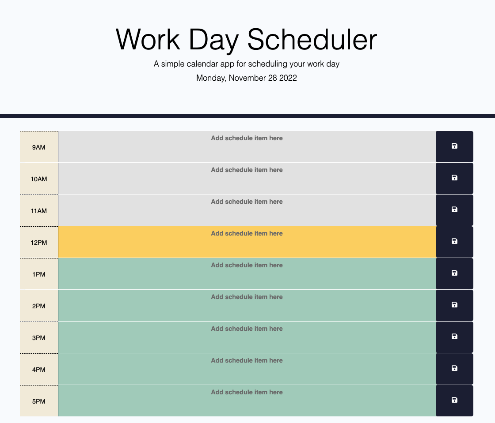

# Work Day Schuduler

## Description

This application is a simple calendar application that allows users to save schedules for each hour of the day. This application is still in progress. 

## Usage
Live application deployed at: https://oliviasylee.github.io/work-day-scheduler/

## Features
1. When it's opened, today's date is displayed at the top of the calendar.
2. When scrolloing down, the user is presented with timeblocks for standard business hours. 
3. Each timeblock is color coded to indicate whether it is in the past, present, or future.
4. If the user click the save button, the text for the schedule is saved in local storage. 
5. It's still remained even if the user refresh the page. 

## Questions
If you have any questions about this projects, please contact me at oliviasylee@gmail.com. You can view more of my projects at https://github.com/oliviasylee.
